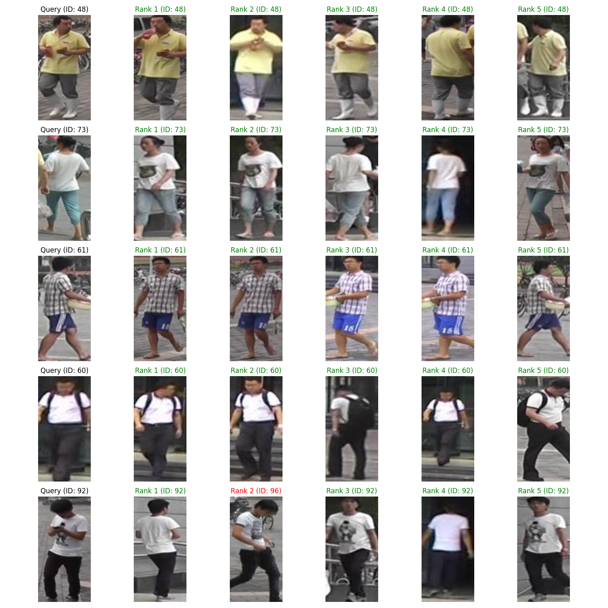

# Person Re-Identification using ResNet18 on Market-1501 Dataset

## Project Overview

This project implements a person re-identification (ReID) system using a modified ResNet18 architecture on the Market-1501 dataset. The goal is to accurately identify and match individuals across multiple non-overlapping camera views in a multi-camera surveillance system.

## Key Features

- **Model Architecture**: Modified ResNet18 backbone
- **Dataset**: Market-1501
- **Evaluation Metrics**: mean Average Precision (mAP), Cumulative Matching Characteristic (CMC)
- **Loss Function**: Cross-Entropy Loss with Label Smoothing

## Dataset

The Market-1501 dataset consists of 32,668 annotated bounding boxes of 1,501 identities. Images are captured from 6 different cameras, with 5 high-resolution cameras and 1 low-resolution camera. The dataset is split into training and testing sets.

## Methodology

### Model Architecture

We use a modified ResNet18 as our backbone network. The final fully connected layer is replaced with a new embedding layer followed by a classification layer. This allows the network to learn discriminative features for person re-identification while maintaining a relatively lightweight architecture.

### Training Process

1. **Data Preprocessing**: Images are resized to 256x128 pixels and normalized.
2. **Data Augmentation**: Random horizontal flipping and color jittering are applied during training.
3. **Optimization**: Adam optimizer with a learning rate of 0.001 and weight decay of 5e-4.
4. **Learning Rate Schedule**: Step decay, reducing the learning rate by a factor of 0.1 every 20 epochs.

### Loss Function

We employ Cross-Entropy Loss with Label Smoothing. Label smoothing helps to prevent the model from becoming overconfident and improves generalization. The loss function is defined as:

```python
class CrossEntropyLabelSmooth(nn.Module):
    def __init__(self, num_classes, epsilon=0.1):
        super(CrossEntropyLabelSmooth, self).__init__()
        self.num_classes = num_classes
        self.epsilon = epsilon
        self.logsoftmax = nn.LogSoftmax(dim=1)

    def forward(self, inputs, targets):
        log_probs = self.logsoftmax(inputs)
        targets = torch.zeros_like(log_probs).scatter_(1, targets.unsqueeze(1), 1)
        targets = (1 - self.epsilon) * targets + self.epsilon / self.num_classes
        loss = (-targets * log_probs).mean(0).sum()
        return loss
```

This loss function distributes a small probability (ε) uniformly among all classes, which helps to reduce overfitting and improve the model's ability to generalize.

## Results

After training, our model achieved the following performance on the test set:

- **mAP (mean Average Precision)**: 0.7837
- **Rank-1 Accuracy (CMC@1)**: 0.9348
- **Rank-5 Accuracy (CMC@5)**: 0.9825
- **Rank-10 Accuracy (CMC@10)**: 0.9903

These results demonstrate strong performance, with the model correctly identifying the same person in the top-1 match 93.48% of the time, and in the top-5 matches 98.25% of the time.


The training curves show consistent improvement in both training and validation metrics over epochs, indicating good model convergence and generalization.



The sample results image demonstrates the model's ability to match query images with correct gallery images across different camera views and poses.

## Conclusion

This project demonstrates the effectiveness of a modified ResNet18 architecture for person re-identification on the Market-1501 dataset. The use of label smoothing in the loss function and careful data preprocessing contributed to achieving competitive results while maintaining a relatively lightweight model architecture.

## Future Work

- Experiment with more advanced architectures like ResNet50 or DenseNet
- Implement triplet loss or other metric learning approaches
- Explore attention mechanisms to focus on discriminative parts of the person
- Investigate domain adaptation techniques for cross-dataset generalization

## Requirements

- Python 3.7+
- PyTorch 2.0+
- torchvision
- numpy
- matplotlib

## Acknowledgements

- Market-1501 Dataset:
  ```
  @inproceedings{zheng2015scalable,
    title={Scalable Person Re-identification: A Benchmark},
    author={Zheng, Liang and Shen, Liyue and Tian, Lu and Wang, Shengjin and Wang, Jingdong and Tian, Qi},
    booktitle={Computer Vision, IEEE International Conference on},
    year={2015}
  }
  ```
- ResNet Architecture: 
    ```
    He, K., Zhang, X., Ren, S., & Sun, J. (2016). Deep Residual Learning for Image Recognition. In Proceedings of the IEEE Conference on Computer Vision and Pattern Recognition (CVPR) (pp. 770-778).
    ```
